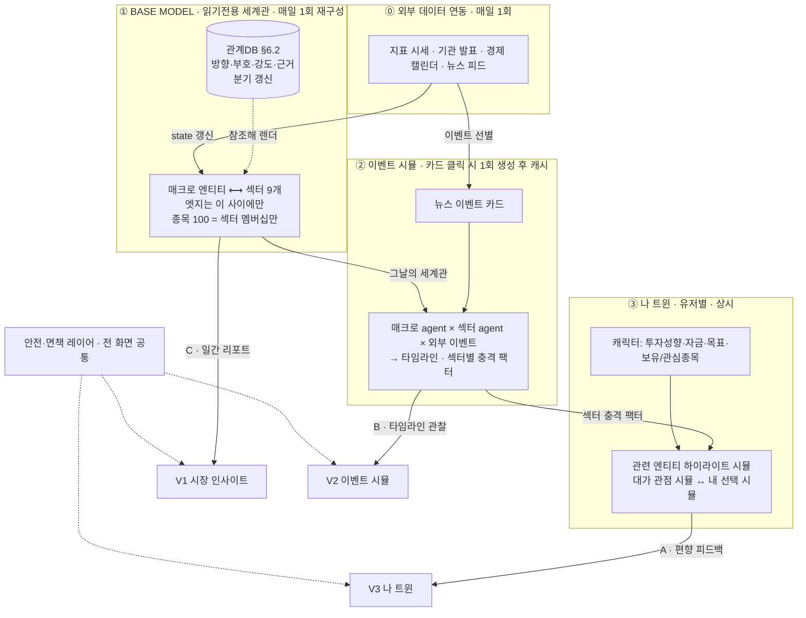

<!-- FINVERSE-DOC · AI 어시스트로 작성한 기획·설계 문서 (원본 소스코드와 구분) -->
> 🟦 **FINVERSE 기획·설계 문서** — AI 어시스트 작성 · 원본 소스(README · app/ · tools/ · worker/)와 **구분되는 산출물**입니다.

# FINVERSE PRD — Product Requirements Document

- **버전**: v0.5 (2026-07-31) · v0.4를 대체
- **작성**: 이유정(기획) · **근거**: [2026-07-29](./회의록/2026-07-29-기획-다듬기.md)(#1~#9) · [2026-07-31 시나리오 정렬](./회의록/2026-07-31-메인-시나리오-정렬.md)(#10~#13) · [2026-07-31 구조 재정의](./회의록/2026-07-31-new-구조-재정의.md)(**#14~#19**)
- **관련**: [README.md](../README.md)(원본 기획서) · [CLAUDE.md](../CLAUDE.md) · [MiroFish 코드해부](./MiroFish-코드해부-리포트.html) · 데모 `demo/`

### 변경 이력
| 버전 | 날짜 | 요지 |
| --- | --- | --- |
| v0.1 | 2026-07-30 | 최초 — 제품 정의 + 화면 3개 와이어프레임 |
| v0.2 | 2026-07-31 | 시스템 아키텍처·아티팩트 계약·기능 모듈·시나리오 확장 모델로 재구성 |
| v0.3 | 2026-07-31 | 용어 정비 — 비유 표현을 도메인 용어로 교체 |
| v0.4 | 2026-07-31 | §4 시스템 아키텍처를 mermaid 다이어그램으로 교체 |
| **v0.5** | **2026-07-31** | **구조 재정의(#14~#19)** — 4층 아키텍처 · 섹터 계층 도입(엣지는 매크로↔섹터만) · 관계DB 분리 · state/관계 갱신 주기 분리 · 이벤트 카드 온디맨드 생성+캐시 · 대가 4인을 나 트윈 전용으로 이동 · 모듈 9개→4덩어리 단순화 · **§10.1 성능·비용 설계 지침 + §10.2 AGPL 대응 신설** |

---

## 1. 개요 & 이 문서 사용법

FINVERSE는 **매일 갱신되는 시장 세계관(Base Model)** 위에서 실제 뉴스 사건을 시뮬레이션해 보여주고, 사용자가 그 속에서 자기 판단을 시험하며 인지 편향을 발견하는 **AI 금융 판단 훈련 서비스**다. (2026 금융 AI Challenge 출품)

| 하려는 일 | 시작 섹션 |
| --- | --- |
| **전체 구조를 이해** | §4 4층 아키텍처 |
| **기능별로 모듈화해 개발** | §4 → §7 모듈 → §8 화면 |
| **관계·데이터를 채워 넣기** | §5 도메인 모델 → §6 데이터 계약 |
| **구조를 재정의** | §4 → §6 스키마(버전) → §12 결정 로그 |

> **설계 원칙(전체 관통)**
> ① **모든 화면은 Base Model의 부분집합을 본다** — 세계는 하나, 뷰가 셋.
> ② **무거운 계산은 하루 1회 또는 카드 1회** — 유저 요청마다 재실행하지 않는다.
> ③ **관계는 그래프가 아니라 DB에 산다** — 근거 없는 수치는 쓰지 않는다.

---

## 2. 제품 정의 (Why)

### 2.1 문제
금융소비자는 예측 가능한 비합리성(과신·손실회피·FOMO·현재편향·기준점 의존)으로 목표에 맞지 않는 결정을 반복한다. 기존 서비스(뉴스·증권앱·금융교육·모의투자)는 **정보는 주지만 판단을 훈련시키지 못한다.**

### 2.2 해결 & 차별점
`시장 세계관 → 사건에 대한 시뮬레이션 → 그 속의 나 → 편향 피드백`을 하나의 경험으로 연결한다. 예측값(가격)을 파는 게 아니라, **사건이 내 포트폴리오에 닿는 경로를 눈으로 보게 하고, 그 앞에서 내 판단을 시험하게 한다.**

### 2.3 3 대표 기능과 그 연관관계 (결정 #14)

**셋은 나란한 기능이 아니라, 같은 Base Model을 점점 좁혀 쓰는 3단계다.**

| | 기능 | 보는 범위 | 성격 | 사용자 가치 | 층 |
| --- | --- | --- | --- | --- | --- |
| **C** | 시장 인사이트 | **세계 전체** | 정보제공 | 오늘의 시장 구조와 일간 인사이트 리포트 | ① Base Model |
| **B** | 사회실험 | **사건 하나로 흔든 세계** | 정보제공 | 이 사건에 매크로·섹터가 어떻게 반응하는지 관찰 | ② 이벤트 시뮬 |
| **A** | 판단 훈련 (**핵심**) | **내 것만 하이라이트한 세계** | **상호작용** | 내 상황에서 내 판단을 시험하고 편향을 발견 | ③ 나 트윈 |

- **①·② = 정보제공**(시장 이해·인사이트 리포트) · **③ = 상호작용**(내재화·예측)
- **화면 흐름 C → B → A** · **비중 A > C > B** (결정 #12 개정)
- **연결 조인트 3개** — 이것만 명세하면 A·B·C 연관관계는 닫힌다:
  1. **C의 이벤트 카드 클릭 → B 생성** (카드 id가 시뮬 트리거이자 캐시 키)
  2. **B의 섹터별 충격 팩터 → A의 계산 입력** (팩터 × 내 종목 비중)
  3. **A의 하이라이트 대상 = ①의 부분집합** (내 종목 → 소속 섹터 → 연결 매크로)

---

## 3. 사용자 & 성공지표

- **B2C(중심)**: 금융 초보 청년 · 사회초년생 투자자. **B2B2C(확장)**: 기관 공통 세계관 + 익명 집계.
- **성공지표**: (북극성) 시뮬 후 "내 상황과 관련 있다" 비율 · (전환) C→B 진입률 · **B→A 전환률(나 트윈 적용률)** · (학습) 편향 사전/사후 변화 · 주간 재방문율.

---

## 4. 시스템 아키텍처 — 4층 (결정 #14)



### 4.1 계층별 책임 & 경계

| 층 | 책임 | 갱신 주기 | 넘지 말 것 |
| --- | --- | --- | --- |
| ⓪ 외부 연동 | 지표·이벤트·뉴스 수집 | **매일 1회** | 관계(인과 구조)를 건드리지 않는다 |
| ① Base Model | 세계관 그래프 재구성 + 일간 리포트 | **매일 1회** | 유저별로 달라지지 않는다 (읽기전용 L1) |
| ② 이벤트 시뮬 | 카드별 시뮬 생성 → 캐시 | **카드당 1회** | 유저별로 재실행하지 않는다 |
| ③ 나 트윈 | 하이라이트 + 유저 상호작용 | 유저 요청 시 | 무거운 시뮬 재실행 금지 (결정론적 계산 + LLM ≤2회) |

### 4.2 갱신 주기 분리 (결정 #17)

| 무엇 | 주기 | 이유 |
| --- | --- | --- |
| **state** (지표 수치·이벤트 발생·뉴스) | **매일 1회** | 매일 변하는 것은 상태값 |
| **관계** (방향·부호·강도) | **분기 정기 리뷰 또는 구조적 변화 시** | 인과 구조가 매일 흔들리면 Base Model이 "안정적 기반"이 아니게 됨 |
| **이벤트 시뮬 캐시** | 카드 최초 클릭 시 생성, 이후 불변 | 같은 카드·같은 날 = 같은 결과 (재현성) |

### 4.3 운영·안전 불변식

- **무결성 (결정 #8 유지)**: Base Model·시뮬 캐시는 **읽기전용(L1)**, 유저 기록은 **트윈(L2)에만**. 유저가 쓸 수 있는 공유 그래프를 만들지 않는다.
- **비용 (결정 #18)**: 무거운 생성은 **하루 = Base Model 1회 + 이벤트 카드 수(5~10)회**. 유저 경로 LLM은 ≤2회/세션.
- **재현성**: 캐시 키 = `카드 id + Base Model 날짜`. 같은 키면 항상 같은 결과.
- **정직성 (결정 #16)**: 근거 없는 정밀 수치 금지. 강도는 3단계 질적 값.

---

## 5. 도메인 모델 (결정 #15)

### 5.1 노드 타입 — 매크로 / 섹터 / 종목

| 계층 | 타입 | 정체 | 예 | 그래프 엣지 |
| --- | --- | --- | --- | --- |
| **매크로** | `indicator` | 시간축 위 상태변수 | 미 기준금리, 한국 기준금리, 미국채10년물, 원/달러 환율, CPI, WTI 유가, 외국인 수급, VIX | ✅ 섹터와 연결 |
| | `institution` | 지표를 움직이는 기관·정부 | 미 연준, 한국은행, 일본은행, 기재부, 금융위, 미 재무부, OPEC+ (7개) | ✅ 지표와 연결 |
| | `event` | 예정·발생한 경제 이벤트 | FOMC, 금통위, CPI 발표, 고용지표, 실적시즌 | ✅ 지표·섹터와 연결 |
| **섹터** | `sector` | 9개 MECE 산업군 | §5.2 | ✅ 매크로와 연결 |
| **종목** | `instrument` | KOSPI 100 개별 종목 | 삼성전자, KB금융 … | ❌ **섹터 멤버십만** |

> **핵심 제약**: 그래프 엣지는 **매크로 ↔ 섹터 사이에만** 존재한다. 종목은 매크로와 직접 연결하지 않는다. 유저 자산 영향은 `매크로 충격 → 섹터 → (멤버십) → 종목 비중` **2-hop**으로 계산되므로 종목 단위 엣지가 불필요하다. (엣지 수백 → 수십으로 축소)

### 5.2 섹터 분류 (9개 MECE)

섹터를 가르는 기준은 산업 분류가 아니라 **매크로 시그니처**(어느 지표에 어떤 방향으로 반응하는가)다.

| # | 섹터 | 종목 | 1차 동인(강) |
| --- | --- | --- | --- |
| S1 | 반도체·IT하드웨어 | 10 | 반도체수요(+) · 외국인수급(+) |
| S2 | 인터넷·소프트웨어·콘텐츠 | 9 | 미10년물(−) |
| S3 | 2차전지·화학소재 | 8 | 전기차수요(+) · 미10년물(−) |
| S4 | 자동차·조선·방산 | 18 | 원/달러(+) |
| S5 | 금융 | 12 | 한국기준금리(+) |
| S6 | 헬스케어 | 7 | 미10년물(−) |
| S7 | 소비재·유통·통신 | 12 | CPI(−) |
| S8 | 에너지·소재 | 12 | — |
| S9 | 건설·인프라·운송 | 12 | 한국기준금리(−) |

- **1종목 1섹터 원칙**. 지주사(삼성물산·SK·LG·SK스퀘어·HD현대·한화)만 예외 규칙 적용.
- **결정 #15의 "7~8개"를 9개로 조정**(2026-07-31) — 8개 안에서는 에너지·소재와 건설·운송이 한 섹터에 묶여 금리·환율·유가 시그니처가 정면 충돌했다. 8/1 회의록에 기록 필요.

> **📄 상세 초안**: [섹터·종목매핑·관계DB 초안](./섹터-종목매핑-관계DB-초안.md) — 섹터 9개 정의와 분할 근거 · **KOSPI 100 전체 매핑** · **관계DB 73행**(방향·부호·강도·근거·확신도) · 삭제 테스트로 제외한 관계 · 강도 실증 계획.

### 5.3 대가 4인 — ③ 나 트윈 전용 (결정 #19)

**② 이벤트 시뮬에는 참여하지 않는다.** 나 트윈에서 **"대표 투자자라면 어떻게 판단했을까"를 시뮬해 보는 참고·엔터테인먼트 장치**로 쓴다.

| 대가 | 렌즈 | 스탠스 | 근거 문서(공개) |
| --- | --- | --- | --- |
| 워런 버핏 | 가치·안전마진 | 신중·관망 | 버크셔 주주서한 |
| 레이 달리오 | 매크로·분산 | 중립·균형 | 『Principles』 |
| 캐시 우드 | 혁신·성장 | 강세·매수 | ARK 리서치 |
| 하워드 막스 | 리스크·사이클 | 경계·과열 | 오크트리 메모 |

- **관점 대립 축**: 캐시 우드 ↔ 하워드 막스 (버핏·달리오가 중간 프레임)
- **면책 라벨(상시 · 결정 #5 유지)**: *"실존 인물의 실제 발언이 아니며, 공개된 투자 원칙을 학습해 재구성한 교육용 시뮬레이션입니다."*
- **아키타입 매핑(결정 #6)**: 가치 / 매크로 / 성장 / 사이클 4축. 유저 판단을 아키타입에 매칭해 "나는 누구 유형인가" 피드백.
- 【미확정】 엔터 요소의 수위 — 재미와 면책의 균형. 8/1 안건 5.

---

## 6. 데이터 계약

### 6.1 BaseModel — 매일 1회 재구성 (읽기전용 L1)

```jsonc
{
  "date": "2026-07-31",
  "schemaVersion": "2.0",
  "nodes": [
    { "id": "us10y", "type": "indicator", "label": "미국채 10년물",
      "state": { "value": 4.12, "changePct": 0.8, "asOf": "2026-07-31" } },
    { "id": "sec-semi", "type": "sector", "label": "반도체·IT하드웨어",
      "state": { "indexChangePct": 1.9, "dominance": 0.31 } }
  ],
  "edges": [ { "relationId": "R-014" } ],   // 관계DB 참조만 — 값은 인라인하지 않음
  "membership": [ { "instrument": "삼성전자", "sector": "sec-semi", "weight": 1.0 } ],
  "dailyReport": { "headline": "...", "body": "...", "citedRelations": ["R-014","R-022"] }
}
```

### 6.2 RelationDB — 분기 갱신 (결정 #16)

**원칙 — 정직성**: 시뮬 트레이스·공개 자료에서 **도출 가능한 것만** 담는다. `0.73` 같은 근거 없는 정밀 수치는 금지. 강도는 3단계 질적 값이 정직한 한계선이며, 안전 원칙("가격·방향 단정 금지")과도 정합한다.

```jsonc
{
  "id": "R-014",
  "from": "us10y", "to": "sec-battery",
  "kind": "drives",          // sets | transmits | drives | triggers | member_of
  "sign": -1,                // +1 촉진 / -1 억제
  "strength": "strong",      // weak | mid | strong  (수치 금지)
  "lag": "short",            // immediate | short(1~5d) | mid(1~4w)
  "basis": "고성장·장기 현금흐름 섹터는 할인율 상승에 민감",
  "evidence": ["공개 자료 URL", "내부 분석 2026-Q2"],
  "confidence": "mid",
  "reviewedAt": "2026-07-31"
}
```

**어휘 5개**

| kind | 방향 | 예 |
| --- | --- | --- |
| `sets` | 기관/정부 → 지표 | 미 연준 → 미 기준금리 |
| `transmits` | 지표 → 지표 | 미 기준금리 → 미국채 10년물 |
| `drives` | 지표 → 섹터 | 미국채 10년물 → 2차전지 (`-1`, `strong`) |
| `triggers` | 경제이벤트 → 지표/섹터 | FOMC → 미 기준금리 |
| `member_of` | 종목 → 섹터 | 삼성전자 → 반도체 (멤버십 테이블) |
| `regulates` 【제안】 | 기관/정부 → 섹터 | 금융위 → 금융 (규제가 지표를 경유하지 않고 직접 작용). 8/1 결정 필요 |

**규모(초안 실측)**: `drives` 47 + `sets` 6 + `transmits` 9 + `triggers` 8 + `regulates` 3 = **73행**. 멤버십 100행 별도. 지표 10 × 섹터 9 = 90 조합 중 실제 등록은 47 — 나머지는 삭제 테스트에서 탈락.

**채택 기준 — "이 관계를 지우면 뭐가 깨지나?"** 소비처는 3곳뿐. 어디에도 안 쓰이면 등록하지 않는다.
1. **자산 영향 계산**(③) — `sign × strength` → 섹터 충격 팩터 → 종목 비중과 곱셈
2. **근거 인용**(③ 편향 카드 · ① 일간 리포트) — `basis`·`evidence`를 문장으로 노출
3. **리플레이 연출**(②) — 타임라인 진행 시 해당 엣지 활성화

### 6.3 EventSimulation — 카드당 1회 생성 후 캐시 (결정 #18)

```jsonc
{
  "cacheKey": "evt-fomc-hold-20260731 @ 2026-07-31",   // 카드 id + BaseModel 날짜
  "eventCard": { "id": "...", "title": "...", "source": "뉴스 출처 URL",
                 "relatedMacro": ["fed","us-ffr"] },
  "agents": [ { "id": "agent-fed", "represents": "미 연준", "type": "macro" },
              { "id": "agent-semi", "represents": "반도체·IT하드웨어", "type": "sector" } ],
  "timeline": [ { "t": "T1", "actor": "agent-fed", "text": "...",
                  "activatedRelations": ["R-003"], "sentiment": 62 } ],
  "sectorImpact": { "sec-semi": { "sign": -1, "strength": "mid" },   // ③의 계산 입력
                    "sec-battery": { "sign": -1, "strength": "strong" } },
  "forecast": { "horizon": "30일", "confidence": 0.7,
                "paths": { "optimistic": { "rangePct": [3.0, 7.5] },   // 범위 표기
                           "base": { "rangePct": [-1.5, 1.5] },
                           "risk": { "rangePct": [-6.0, -2.0] } } },
  "masterViews": [ { "persona": "캐시 우드", "reading": "...", "choice": "buy" } ],  // ③에서 소비
  "generatedAt": "...", "provenance": { "agentCount": 21, "rounds": 6 }
}
```

### 6.4 UserTwin — 유저별 (L2 · 비공개)

```jsonc
UserTwin { "profile": { "riskTolerance", "capital", "goals":[{"name","horizon","target"}] },
           "holdings": [ { "ticker", "weight" } ],   // 또는 관심종목
           "biasHistory": [ ... ] }                  // 지속·누적

PersonalizationResult { "impactedSectors":[...], "goalImpact":{...},
                        "closestPersona", "oppositePersona",
                        "detectedBias":[], "archetype" }   // 온라인 계산
```

> **계산 방식**: `EventSimulation.sectorImpact` × `UserTwin.holdings`(섹터 멤버십 경유) = 목표 영향. **결정론적 곱셈이며 LLM 불필요.** LLM은 ① "왜 그렇게 판단했나" 입력의 편향 분류 ② 결과를 유저 목표 언어로 요약, 두 곳에만 쓴다(≤2회/세션).

---

## 7. 모듈 — 4덩어리 (결정 #14, 문제 3 해소)

기존 M0~M8 9개 라벨을 **실제 산출물 단위**로 접는다.

```
[배치 파이프라인 · 매일]  외부연동 → state 갱신 → BaseModel 빌드 → 일간 리포트 → 이벤트 카드 선별
        │  (관계DB 참조 · 분기 갱신)
[시뮬 생성기 · 카드당 1회]  경량 agent 시뮬 → EventSimulation 저장(캐시)
        │
[앱 서버 1개]  BaseModel 조회 · 카드 목록 · 시뮬 조회 · 트윈 저장 · 선택→피드백
        │
[화면 3개]  V1 시장 인사이트(C) · V2 이벤트 시뮬(B) · V3 나 트윈(A)
```

> **"매일 세계를 굽고, 카드마다 시뮬을 한 번 굽고, 서버 하나로 서빙하고, 화면 셋을 그린다."** 개발 3인 분담 단위와 일치.

| 덩어리 | 구성 작업 | 산출물 | MVP | 구 M 번호 |
| --- | --- | --- | --- | --- |
| **배치 파이프라인** | 데이터 연동 · state 갱신 · 그래프 빌드 · 리포트 생성 · 카드 선별 | `BaseModel` (일 1회) | P0 | M0·M1 |
| **관계DB** | 73행 큐레이션 (방향·부호·강도·근거) | `RelationDB` (분기) | P0 | (신규) |
| **시뮬 생성기** | 경량 agent 시뮬 실행 · 캐시 저장 | `EventSimulation` | P0 | M0 일부 |
| **앱 서버** | 조회 API 4~5개 · 트윈 저장 · 편향 피드백 계산 | REST | P0 | M1·M6·M7 |
| **V1 시장 인사이트** | 세계관 그래프 · 일간 리포트 · 이벤트 카드 목록 | 화면 | P0 | M2 |
| **V2 이벤트 시뮬** | 타임라인 리플레이 · 섹터 반응 | 화면 | P1 | M3·M4 |
| **V3 나 트윈** | 캐릭터 설정 · 하이라이트 시뮬 · 대가/내 선택 · 편향 피드백 | 화면 | P0 | M5 |
| **안전·면책 레이어** | 면책 라벨 · 교육용 고지 공통 컴포넌트 | 공통 | P0 | M8 |

**임계 경로(MVP)**: 배치 파이프라인 + 관계DB → 앱 서버 → V1 → V3. V2는 P1로 뒤이어. (V2 지연 시에도 V1의 카드에서 V3로 직행 가능한 경로를 남긴다.)

---

## 8. 화면 명세

| 화면 | 층 | P0 요소 | P1 요소 |
| --- | --- | --- | --- |
| **V1 시장 인사이트 (C)** | ① | 매크로↔섹터 세계관 그래프 · 지표 state · **일간 인사이트 리포트** · **뉴스 이벤트 카드 목록** | 종목 검색 · 관계 상세 팝오버(`basis`·`evidence`) |
| **V2 이벤트 시뮬 (B)** | ② | 카드 클릭 → 타임라인 리플레이 · agent 발언 · 관계 활성화 연출 · 섹터별 충격 · 3경로 전망 | 생성 진행 UX · provenance 상세 |
| **V3 나 트윈 (A)** | ③ | 캐릭터 설정(성향·자금·목표·보유/관심종목) · **관련 엔티티만 하이라이트** · **대가 관점 시뮬 / 내 선택 시뮬** · 목표 영향 before→after · 편향 카드 · 아키타입 | 누적 리포트 · 아키타입 확정 |

- **하이라이트 규칙(V3)**: 내 종목 → 소속 섹터 → 연결 매크로. 나머지는 흐리게. (결정 #11 흡수 — 별도 토글 불필요)
- **차트 규칙**: 빨강=상승 / 파랑=하락(한국 관례). 3경로는 diverging(낙관 red↑ / 기준 neutral / 위험 blue↓).
- **전망 표기**: 단일 수치가 아닌 **범위**(§6.3 `rangePct`) — 안전 원칙 정합.

---

## 9. 확장 모델

- **세계 확장**: 섹터·매크로 엔티티 추가 → 관계DB에 행 추가. 코드 변경 없음.
- **시장 확장**: KOSPI 외 시장은 섹터 계층을 하나 더 두는 방식으로 병렬 추가.
- **시나리오 확장**: 이벤트 카드가 곧 시나리오 단위. 뉴스 피드가 매일 공급하므로 **수동 시나리오 제작이 불필요**해짐(기존 v0.4 대비 큰 변화).
- **구조 재정의**: `schemaVersion`을 올리고 계층별로 소비. 계약(§6)만 지키면 시뮬 엔진 교체 가능.
- **B2B2C**: 같은 BaseModel·카드를 기관 공통으로 배포, 개인 결과는 L2에만. 기관엔 익명 집계.

---

## 10. 비기능 요구사항 & 제약

- **시뮬 엔진 제약(MiroFish 코드해부 근거)**: OASIS + Zep Cloud, AGPL-3.0, 단일프로세스·무인증·비재현·토큰폭식. → 온디맨드로 전환(결정 #18)했으므로 **경량화 검증이 선결**(§12 오픈 이슈). 캐시로 동시성·비용을 흡수.
- **안전 원칙**: 가격·수익·방향 단정 금지 → 조건부 **범위** + 신뢰구간. 실계좌 연동 없음(가상 프로필). 상품 추천 금지. 페르소나 면책 라벨 상시.
- **성능/비용 상한**: 하루 생성 = BaseModel 1회 + 카드 5~10회. 유저 경로 LLM ≤2회/세션. 캐시 히트 시 LLM 0회.

### 10.1 성능·비용 설계 지침 (구현 시 참조)

> **핵심 원칙 하나**: **요청 경로에서 생성을 떼어낸다.** 나머지 항목은 전부 이 위에 얹힌다. 이 구조가 성능 문제와 §10.2 AGPL 분리를 동시에 해결한다.

**(1) 비동기 잡 큐 — 인라인 생성 금지 (최우선)**

```
카드 클릭 → 잡 등록(즉시 응답) → 진행 상태 폴링/SSE → 완료 시 캐시에서 서빙
```
요청 핸들러 안에서 시뮬을 직접 실행하지 않는다. HTTP 타임아웃·워커 점유·재시도 폭주를 모두 회피한다.

**(2) 캐시 우선 + 싱글플라이트**
- 캐시 키 `카드 id + BaseModel 날짜`로 먼저 조회. 히트면 **LLM 0회**.
- 같은 카드를 여러 명이 동시에 처음 눌러도 **생성 잡은 1개만** 만들고 나머지는 같은 잡에 붙인다(thundering herd 방지). 잡 등록 시 키 유니크 제약으로 처리.

**(3) 프롬프트 캐싱 — 공통 프리픽스 설계**

BaseModel + 관계DB는 하루 동안 고정이라 적중률이 매우 높다. 단 **프리픽스 매치**이므로 배치 순서가 전부다.
- 렌더 순서는 `tools → system → messages`. **고정 콘텐츠(BaseModel 스냅샷·관계DB·에이전트 페르소나)를 앞에**, 카드별·에이전트별 가변 콘텐츠를 **마지막 브레이크포인트 뒤에** 둔다.
- system 프롬프트에 `now()`·UUID·카드 id를 **절대 넣지 않는다** (프리픽스가 매 요청 달라져 캐시 전멸). JSON 직렬화는 키 정렬 고정.
- 최소 캐시 길이: Opus 5는 512토큰(모델별로 다름). BaseModel 프리픽스는 충분히 넘는다.
- 경제성: 캐시 읽기 ~0.1×, 쓰기 1.25×(5분 TTL) → **2회 요청부터 이득**. 하루 종일 같은 BaseModel을 재사용하므로 `ttl: "1h"`(쓰기 2×) + 주기적 재예열도 검토 가치 있음.
- ⚠️ **동시 요청 함정**: 캐시는 첫 응답이 스트리밍을 시작해야 읽을 수 있다. **섹터 에이전트 9개를 한꺼번에 던지면 전원 캐시 미스**가 난다. → 1개를 먼저 보내고 첫 토큰 수신 후 나머지를 팬아웃한다.
- 검증: `usage.cache_read_input_tokens`가 0이 아닌지 확인(0이면 프리픽스 오염).

**(4) 배치 경로는 Batch API로 50% 절감**
- **BaseModel 일간 리포트**와 **인기 예상 카드 사전 생성(prewarm)**은 지연에 민감하지 않다 → Batch API로 토큰 비용 50% 절감(대부분 1시간 내, 최대 24시간).
- 유저 클릭 경로에는 쓰지 않는다(지연 때문).

**(5) 모델·effort 설정 — 측정 후 결정**
- **기본은 최신 상위 모델로 구현하고 실측**한다. 비용 때문에 낮은 티어로 내리는 것은 실측 후 팀 결정 사항.
- **`effort` 파라미터가 1차 비용 레버**(모델 교체보다 먼저 시도). 섹터 에이전트 발언처럼 정형화된 작업은 낮은 effort부터 스윕해 품질이 유지되는 지점을 찾는다.
- ⚠️ 모델을 섞으면 **프롬프트 캐시가 모델 단위로 분리**된다. 티어링 이득과 캐시 손실을 함께 계산할 것.

**(6) 구조화 출력으로 파싱 실패 제거**
- 에이전트 발언·섹터 충격 팩터는 JSON 스키마를 강제한다(정규식·문자열 파싱 금지). §6.3 스냅샷 스키마와 1:1로 대응시키면 검증 코드가 사라진다.

**(7) 결정론적 계산은 LLM 밖으로** *(§6.4 원칙 재확인)*
- `섹터 충격 팩터 × 트윈 보유 비중`은 순수 곱셈. LLM 호출 대상이 아니다.
- 유저 경로 LLM은 ① "왜 그렇게 판단했나" 편향 분류 ② 결과 요약, **2회 상한**.

**(8) 상한과 폴백**
- 잡별 토큰 상한·타임아웃·최대 재시도 횟수를 설정값으로 강제한다.
- 생성 실패 시 **그날의 BaseModel 기반 정적 요약**으로 폴백(빈 화면 금지).
- 【미확정】 목표 생성 시간(SLO) — 프로토타입 실측 후 확정.

### 10.2 AGPL 대응 (결정 #18로 재검토 필요해진 항목)

**AGPL-3.0 = GPL + §13 네트워크 조항.** GPL은 소프트웨어를 *배포*할 때 소스 공개 의무가 생기지만, AGPL은 여기에 더해 **"수정한 프로그램을 네트워크 너머 사용자와 상호작용하게 하면"** 그 사용자에게 대응 소스를 제공하도록 요구한다(이른바 SaaS 구멍을 막은 조항).

**왜 지금 재검토인가**: 결정 #9(오프라인 내부 도구)에서는 §13이 트리거되지 않았다. 결정 #18(카드 클릭 → 생성)은 **§13이 정확히 겨냥하는 형태**다.

**완화 설계 = §10.1(1)의 비동기 잡 큐와 동일**. 경계를 명시적으로 둔다:
- 생성기는 **별도 프로세스**. FINVERSE 앱 코드는 MiroFish를 import·링크하지 않는다.
- 통신은 **스냅샷 JSON 파일(§6.3) 단방향**. 앱이 유저 요청을 MiroFish로 프록시하지 않는다.
- 유저는 MiroFish와 상호작용하지 않고, MiroFish가 **미리 만들어 둔 산출물**과 상호작용한다.

⚠️ **이 설계가 의무를 면제한다고 단정하지 않는다 — 법률 판단은 별건.** 공모전 제출 조건과 함께 1회 확인이 필요하다(§12 오픈 이슈).

**폴백 옵션**: 의무 범위가 넓다고 판단되면 ① 생성기 소스 공개 ② 엔진 교체(계약 §6만 지키면 가능 — 결정 #16의 이점).

---

## 11. MVP 범위 & 로드맵

- **In(MVP)**: KOSPI 1시장 · 섹터 9개 · 관계DB 73행 · 일간 BaseModel + 인사이트 리포트 · 이벤트 카드 3~5개 · 나 트윈 기본 · 대가 4인 참고 시뮬 · 편향 피드백.
- **Out(후속)**: 다중 시장 · 종목 단위 관계 · 실계좌 · 자유 커스텀 이벤트 · B2B2C 대시보드 · 아키타입 누적 확정.

| 단계 | 목표 | 덩어리 |
| --- | --- | --- |
| **1. 세계 구축** | 매일 갱신되는 BaseModel + 일간 리포트가 서는 것 | 배치 파이프라인 · 관계DB · V1 |
| **2. 상호작용** | 카드 → 나 트윈 → 편향 피드백 한 줄 동작 | 앱 서버 · V3 (+시뮬 생성기 최소판) |
| **3. 차별화** | 이벤트 시뮬 타임라인 리플레이(B) 완성 | 시뮬 생성기 · V2 |

---

## 12. 오픈 이슈 & 결정 로그

**오픈 이슈 (8/1 회의 안건)**
- [ ] 섹터 9개 안 승인 + 종목 매핑 규칙(지주사 예외) — 결정 #15의 "7~8개"를 9개로 조정한 사실 기록
- [ ] 관계DB 큐레이션 담당·일정 · 근거 출처 기준
- [ ] 이벤트 카드 선별 기준 (하루 몇 개, 무엇을 매크로 관련으로 볼 것인가)
- [ ] 나 트윈 캐릭터 설정 항목 확정 + 무보유 유저 템플릿 포트폴리오
- [ ] 대가 시뮬의 엔터 요소 수위 + 실명 사용 권리 조항 확인
- [ ] 편향 판정에 "왜 그렇게 판단했나" 한 줄 입력 포함 여부
- [ ] 경량 agent 시뮬 생성 시간·토큰 실측 → 목표 생성 시간(SLO) 확정 (결정 #18 타당성 · §10.1(8))
- [ ] **AGPL 의무 범위 법률 확인** — §10.2의 프로세스 분리 설계가 §13 트리거를 피하는지, 공모전 권리 조항과 함께 1회 검토

**해소된 이슈** — 구조 변경의 부수 효과로 소멸
- [x] outcome 저장 방식 논쟁 → **섹터 충격 팩터 × 트윈 보유 비중**으로 계산(§6.4). 사전 저장 불필요
- [x] 전망 단일 수치 vs 범위 → **범위로 확정**(§6.3)
- [x] progressive disclosure 토글 설계 → V3 하이라이트에 흡수

**결정 로그**: [#1~#9](./회의록/2026-07-29-기획-다듬기.md) · [#10~#13](./회의록/2026-07-31-메인-시나리오-정렬.md) · [**#14~#19**](./회의록/2026-07-31-new-구조-재정의.md). 전체 요약(개정 표기 포함)은 구조 재정의 회의록 §10.

---

## 부록 A. 용어집

- **BaseModel**: 매일 1회 재구성되는 읽기전용 세계관 그래프(§6.1). 모든 화면의 공통 기반.
- **관계DB(RelationDB)**: 엔티티 간 관계를 방향·부호·강도·근거로 정의한 별도 데이터(§6.2). 그래프는 이를 참조해 렌더링만 한다.
- **이벤트 카드**: 뉴스에서 선별한 매크로 관련 사건. 시뮬 트리거이자 캐시 키.
- **EventSimulation**: 카드당 1회 생성해 캐시하는 시뮬 결과(§6.3) = 타임라인 트레이스 + 섹터 충격 팩터 + 3경로 전망.
- **섹터 충격 팩터**: 시뮬이 산출한 섹터별 `sign × strength`. 유저 자산 영향 계산의 입력.
- **트윈(Twin)**: 유저의 가상 재무 상태(L2). 지속·누적.
- **L1 / L2**: L1 = 읽기전용 공유 데이터(BaseModel·시뮬 캐시), L2 = 유저 전용 기록(트윈). 무결성 경계.
