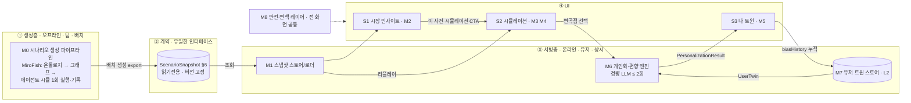

<!-- FINVERSE-DOC · AI 어시스트로 작성한 기획·설계 문서 (원본 소스코드와 구분) -->
> 🟦 **FINVERSE 기획·설계 문서** — AI 어시스트 작성 · 원본 소스(README · app/ · tools/ · worker/)와 **구분되는 산출물**입니다.

# FINVERSE PRD — Product Requirements Document

- **버전**: v0.4 (2026-07-31) · v0.3을 대체
- **작성**: 이유정(기획) · **근거**: [2026-07-29](./회의록/2026-07-29-기획-다듬기.md) · [2026-07-31](./회의록/2026-07-31-메인-시나리오-정렬.md) 회의록 (결정 #1~#13)
- **관련**: [README.md](../README.md)(원본 기획서) · [CLAUDE.md](../CLAUDE.md) · [MiroFish 코드해부](./MiroFish-코드해부-리포트.html) · 데모 `demo/`

### 변경 이력
| 버전 | 날짜 | 요지 |
| --- | --- | --- |
| v0.1 | 2026-07-30 | 최초 — 제품 정의 + 화면 3개 와이어프레임 |
| v0.2 | 2026-07-31 | 시스템 아키텍처·아티팩트 계약·기능 모듈·시나리오 확장 모델로 재구성 (모듈 개발/시나리오 추가/구조 재정의 대비) |
| v0.3 | 2026-07-31 | 용어 정비 — 비유 표현을 도메인 용어로 교체 (얼린 아티팩트→시나리오 스냅샷 · 촬영↔상영→1회 실행·기록→리플레이 · 척추→핵심 기능 · 오염→무결성 등) |
| **v0.4** | **2026-07-31** | **§4 시스템 아키텍처를 mermaid 다이어그램으로 교체** (모듈·화면·데이터 흐름 시각화) |

---

## 1. 개요 & 이 문서 사용법

FINVERSE는 시장 사건을 **대가 4인과 군중이 반응하는 가상세계로 미리 시뮬레이션해 두고**, 사용자가 그 속에서 자기 판단을 시험하며 인지 편향을 발견·교정하는 **AI 금융 판단 훈련 서비스**다. (2026 금융 AI Challenge 출품)

**이 PRD는 세 갈래 후속 작업의 단일 기준점이다.** 새 세션은 목적에 따라 아래 섹션부터 읽으면 된다:

| 하려는 일 | 시작 섹션 |
| --- | --- |
| **기능별로 모듈화해 개발** | §4 아키텍처 → §7 기능 모듈 → §8 화면 |
| **시나리오를 추가·다듬어 연결고리 강화** | §6 스냅샷 스키마 → §9 시나리오 확장 모델 |
| **구조를 재정의** | §4 아키텍처 → §6 스키마(버전) → §12 결정 로그 |

> **설계 원칙(전체 관통)**: 모든 화면·모듈은 **시나리오 스냅샷(§6)을 소비**한다. 무거운 계산은 오프라인(§4). 온라인은 얇게. 시나리오는 코드가 아니라 **데이터(스냅샷)로 추가**된다.

---

## 2. 제품 정의 (Why)

### 2.1 문제
금융소비자는 예측 가능한 비합리성(과신·손실회피·FOMO·현재편향·기준점 의존)으로 목표에 맞지 않는 결정을 반복한다. 기존 서비스(뉴스·증권앱·금융교육·모의투자)는 **정보는 주지만 판단을 훈련시키지 못한다.**

### 2.2 해결 & 차별점
`시장 시뮬레이션 → 그 속의 나 → 편향 피드백`을 하나의 경험으로 연결한다. 예측값(가격)을 파는 게 아니라, **대가들의 대비되는 판단 vs 나의 판단**을 겨루게 한다.

### 2.3 3 대표 기능 (비중 A > C > B)
| | 기능 | 사용자 가치 | 이 PRD의 담당 |
| --- | --- | --- | --- |
| **A** | 판단 훈련 (**핵심 기능**) | 내 편향 발견·교정 | M5 나 트윈 · M6 편향엔진 |
| **B** | 사회실험 | 군중·대가 반응 관찰 | M4 가상세계 그래프 |
| **C** | 가격 예측 | 친숙한 진입 데이터 | M2 시장 인사이트 |

---

## 3. 사용자 & 성공지표

- **B2C(중심)**: 금융 초보 청년 · 사회초년생 투자자. **B2B2C(확장)**: 기관 공통 시나리오 + 익명 집계.
- **성공지표**: (북극성) 시뮬 후 "내 상황과 관련 있다" 비율 · (전환) 시뮬 시작률·완료율·**나 트윈 적용률** · (학습) 편향 사전/사후 변화·주간 재방문율.

---

## 4. 시스템 아키텍처

**4계층. 무거운 것은 왼쪽(오프라인), 사용자는 오른쪽(온라인).** 계층 사이는 **시나리오 스냅샷(§6)이라는 계약**으로만 연결된다 → 각 계층을 독립적으로 교체·개발 가능.



### 4.1 계층별 책임 & 경계
| 계층 | 책임 | 넘지 말 것 |
| --- | --- | --- |
| ① 생성층 | 시나리오를 배치 생성해 **스냅샷으로 export** | 유저 요청 경로에 들어오지 않는다 |
| ② 계약 | 오프라인↔온라인, 시나리오↔UI의 **유일한 인터페이스**(§6) | 스키마는 버전 관리, 임의 확장 금지 |
| ③ 서빙층 | 스냅샷 서빙 + **유저별 경량 개인화** | 무거운 시뮬 재실행 금지 |
| ④ UI | 아티팩트·개인화 결과 렌더 | 비즈니스 로직 최소 |

### 4.2 운영·안전 불변식 (결정 #8·#9)
- **무결성**: 유저가 쓸 수 있는 공유 그래프를 만들지 않는다. 스냅샷은 읽기전용(L1), 유저는 자기 트윈(L2)만 쓴다.
- **안정성**: 오프라인에서 여러 번 돌려 대표 결과를 **스냅샷으로 고정**(엔진 자체는 비재현).
- **비용**: 무거운 시뮬은 시나리오당 1회(오프라인), 유저 경로 LLM은 개인화 1~2회.

---

## 5. 도메인 모델 (온톨로지)

### 5.1 노드 타입 (3+1 계층 · 결정 #3)
| 타입 | 정체 | 예 |
| --- | --- | --- |
| **Force** | 시간축 위 상태변수(환경) | 미·한 기준금리, 환율, 미10년물, CPI, 유가, 반도체수요, 외국인수급, VIX |
| **Institution** | Force를 움직이는 의사결정 기관 | 미 연준, 한국은행, ECB, 일본은행, 기재부, 미 재무부, 금융위, IMF |
| **Persona** | Force를 관측·발언하는 행위자(에이전트) | 대가 4인 + 리테일 군중 |
| **Instrument** | 시장·종목 | KOSPI, 삼성전자 … (KOSPI 100) |

관계 예: `기관 → Force 설정 → 섹터·종목 구동`, `Persona → Force 관측 / Instrument 보유`.

### 5.2 대가 로스터 4인 (실명 + 강한 면책 · 결정 #4·#5)
| 대가 | 관점 | 스탠스 | 근거 문서(공개) |
| --- | --- | --- | --- |
| 워런 버핏 | 가치·안전마진 | 신중·관망 | 버크셔 주주서한 |
| 레이 달리오 | 매크로·분산 | 중립·균형 | 『Principles』 |
| 캐시 우드 | 혁신·성장 | 강세·매수 | ARK 리서치 |
| 하워드 막스 | 리스크·사이클 | 경계·과열 | 오크트리 메모 |

- **관점 대립 축**: 캐시 우드 ↔ 하워드 막스. 종토방·FOMO 군중은 배경 OASIS 군중.
- **면책 라벨(상시)**: *"실존 인물의 실제 발언이 아니며, 공개된 투자 원칙을 학습해 재구성한 교육용 시뮬레이션입니다."*
- **아키타입 매핑(결정 #6)**: 각 대가는 아키타입의 인스턴스 — 가치 / 매크로 / 성장 / 사이클. 유저 판단을 아키타입에 매칭.

---

## 6. 시나리오 스냅샷 스키마 — **연결고리의 핵심** (결정 #13)

**시나리오 스냅샷 = 오프라인 배치 생성물이자 온라인의 유일한 입력(읽기전용·버전 고정).** 이 계약이 안정적이면 시나리오 추가·화면 개발·엔진 교체가 서로를 깨지 않는다. (아래는 논리 스키마 — 실제 JSON/타입은 개발 시 확정)

```jsonc
// ScenarioSnapshot — 시나리오 1개 = 파일 1개 (읽기전용·버전관리)
{
  "id": "chip-rally-inflection",
  "title": "AI 반도체 랠리 → 변곡점",
  "schemaVersion": "1.0",
  "createdAt": "...", "engineSeed": "...",

  "graph": {                      // ① base 그래프 스냅샷 (M4 가상세계가 그림)
    "nodes": [ { "id","type":"force|institution|persona|instrument","label","sector?" } ],
    "edges": [ { "a","b","kind","base": true } ]
  },
  "timeline": [                   // ② 에이전트 상호작용 트레이스 (리플레이용)
    { "t":"T1","kind":"event|agent","actor":"캐시 우드","tag":"강세",
      "text":"...","pulseNodes":["삼성전자"],"growEdges":[["VIX","반도체수요"]],"sentiment":75 }
  ],
  "forecast": {                   // ③ C·요약이 쓰는 3경로
    "horizon":"30일","confidence":0.7,
    "paths": { "optimistic":{"pct":6.8,"points":[...]},
               "base":{"pct":-0.5,"points":[...]},
               "risk":{"pct":-4.2,"points":[...]} }
  },
  "branches": [                   // ④ "나 개입" 분기 트리 (사전 계산)
    { "atStep":"T4","prompt":"당신이라면?",
      "options":[ { "id":"buy","label":"더 산다",
                    "outcome":{ "closestPersona":"캐시 우드","detectedBias":["FOMO","과신"],
                                "goalImpact":{"stability":[70,52],"riskExposure":[58,78]},
                                "archetype":"성장 낙관형" } } ] }
  ],
  "personas": [ { "id","name","lens","stance","quote","sources":[...] } ],  // ⑤ 대가 카드
  "provenance": { "engine":"MiroFish","personaCount":512,"rounds":36,"note":"..." }
}
```

**유저 측 객체(온라인, L2·비공개)** — 스냅샷과 분리:
```jsonc
UserTwin { "holdings":[{"ticker","weight"}], "goals":[{"name","horizon","target"}],
           "riskTolerance", "biasHistory":[...] }        // 지속·누적
PersonalizationResult { "closestPersona","oppositePersona","detectedBias":[],
           "goalImpact":{...}, "archetype" }              // 온라인 계산(M6)
```

> **왜 이렇게 나누나**: `branches[].outcome`을 스냅샷에 **미리 계산해** 두면(결정 #9), 온라인은 유저 선택 → 해당 outcome 조회 + 유저 트윈 대입만 하면 된다(라이브 시뮬 0). 개인화 LLM은 "이 outcome을 내 목표 언어로 설명" 정도의 경량 역할.

---

## 7. 기능 모듈

**스냅샷 계약(§6) 위에서 각 모듈은 독립 개발 가능.** 새 세션은 모듈 하나를 골라 입력/출력 계약만 지키면 된다.

| ID | 모듈 | 책임 | 입력 | 출력 | 의존 | MVP | 화면 |
| --- | --- | --- | --- | --- | --- | --- | --- |
| **M0** | 시나리오 생성 파이프라인 | MiroFish 실행 → 스냅샷 export | 시드 문서·설정 | `ScenarioSnapshot` | MiroFish | P0(팀·오프라인) | — |
| **M1** | 스냅샷 스토어/로더 | 시나리오 스냅샷 저장·서빙 | 스냅샷 파일 | 조회 API | M0 | P0 | — |
| **M2** | 시장 인사이트 (C) | 매크로·종목·가격 진입 + 이벤트 CTA | `graph`,`forecast` | 화면 S1 | M1 | P0 | S1 |
| **M3** | 시뮬 요약 뷰 | 대가 반응 + 3경로 + 변곡점 선택 | `personas`,`forecast`,`branches` | 선택값 | M1 | P0 | S2 |
| **M4** | 가상세계 그래프 (B) | 그래프 + 리플레이 · progressive disclosure | `graph`,`timeline` + `twin.holdings` | 시각화 | M1,M7 | P1 | S2 |
| **M5** | 나 트윈 (A) | 목표 영향 + 나 vs 대가 편향 | 선택값 + `twin` + 개인화 | 화면 S3 | M6,M7 | P0 | S3 |
| **M6** | 개인화·편향 엔진 | 선택+트윈+outcome → 편향/목표영향 설명 | 선택,`twin`,`branches.outcome` | `PersonalizationResult` | M1,M7 | P0 | (S3) |
| **M7** | 유저 트윈 스토어 (L2) | 가상 프로필·편향 히스토리 지속 | 유저 입력 | `UserTwin` | — | P0 | 온보딩 |
| **M8** | 안전·면책 레이어 | 면책 라벨·교육용 고지 상시 | — | UI 공통 컴포넌트 | — | P0 | 공통 |

### 7.1 의존 관계
```
M0 ─▶ M1 ─▶ M2 (S1)
             ├▶ M3 (S2) ─┐
   M7 ─▶ M4 (S2)         ├▶ 선택값 ─▶ M6 ─▶ M5 (S3)
   M7 ─────────────────────────────────┘
M8: 전 화면 공통 (의존 없음)
```
**임계 경로(MVP)**: M0→M1→M3→M6→M5. M4(가상세계)는 P1로 뒤이어. M2는 진입, M7·M8은 병렬.

---

## 8. 화면 명세 (UI)

와이어프레임 실물: `demo/finverse-simulation.html`(S1→S2→S3), `demo/finverse-world.html`(가상세계).

| 화면 | 소비 모듈 | P0 요소 | P1 요소 |
| --- | --- | --- | --- |
| **S1 시장 인사이트** | M2 | 지수·시장연결·AI 요약·이벤트 타임라인·**"이 사건 시뮬레이션" CTA** | 종목 검색·커스텀 빌더 |
| **S2 시뮬레이션** | M3(요약)+M4(가상세계) | 대가 4인 카드(+면책)·3경로 차트·**변곡점 선택**·"내 트윈 적용" / [🌍 전체 세계 펼치기] | 다단계 분기·provenance 상세 |
| **S3 나 트윈** | M5 | 목표 영향 before→after·**나 vs 대가 편향**·가상 프로필(스킵 가능) | 누적 리포트·아키타입 매칭 |

- **S2 노출 원칙(결정 #10·#11·#12)**: 월드 그래프는 A의 근거(프로버넌스)이자 B의 관찰 뷰 — 전면에 내세우는 주 기능이 아니다. 기본은 **내 보유 종목 + 1-hop 관련 노드만 활성**, 전체 세계는 펼치기 옵션. 화면 흐름은 C→A→B, 비중 A>C>B.
- **차트 규칙**: 빨강=상승 / 파랑=하락(한국 관례), 3경로는 diverging(낙관 red↑ / 기준 neutral / 위험 blue↓).

---

## 9. 시나리오 확장 모델

**시나리오 = 스냅샷 1개(§6). 추가·교체는 데이터 작업이지 코드 작업이 아니다.**

- **추가**: M0(오프라인)에 새 시드를 넣어 새 스냅샷을 배치 생성한다 → 서빙 모듈은 그대로. (예: "금리 인상기 대출 관리", "환율 급등", 역사적 위기)
- **연결고리 강화**: 스냅샷의 `timeline`(에이전트 상호작용)·`branches`(분기 깊이)·`graph.edges`(역주입)를 풍부하게. **품질 기준** 제안: 페르소나 대비 4축 이상 · 분기 outcome 4개 이상 · 여론 반전 1회 이상 · provenance 명시.
- **구조 재정의**: `schemaVersion`을 올리고 모듈이 버전으로 소비. 계약(§6)만 지키면 엔진(MiroFish)조차 교체 가능.
- **B2B2C**: 같은 스냅샷을 기관 공통 시나리오로 배포, 개인 결과는 L2에만. 기관엔 익명 집계.

---

## 10. 비기능 요구사항 & 제약

- **MiroFish 제약(근거: 코드해부)**: OASIS + Zep Cloud, AGPL-3.0, 단일프로세스·무인증·비재현·토큰폭식 → **오프라인 도구로만**(§4). 그래프는 Zep에 상주(로컬 DB 없음).
- **라이선스**: AGPL — 내부 도구 전제. 서비스 배포 시 의무 범위 사전 확인.
- **안전 원칙(README 계승)**: 가격·수익·방향 단정 금지 → 조건부 범위+신뢰구간. 실계좌 연동 없음(가상 프로필). 상품 추천 금지. 페르소나 면책 라벨 상시.
- **성능/비용**: 유저 경로 LLM ≤ 2회/세션. 무거운 시뮬은 오프라인.

---

## 11. MVP 범위 & 로드맵

- **In(MVP)**: KOSPI 1시장 · 반도체 랠리 시나리오 1개(+분기) · 대가 4인 · 나 트윈 기본 · 편향 피드백.
- **Out(후속)**: 유저별 라이브 시뮬 · 다중 시장/종목 · 실계좌 · 자유 커스텀 시나리오 · B2B2C 대시보드.

| 단계 | 목표 | 모듈 |
| --- | --- | --- |
| **1. 코어 루프** | C→A 한 줄 동작(진입→선택→편향 피드백) | M0·M1·M2·M3·M6·M5·M7·M8 |
| **2. 차별화** | 가상세계 그래프·리플레이(B) 연결 | M4 |
| **3. 확장** | 시나리오 2~3개 추가 · 아키타입 누적 리포트 | M0(반복)·M5(P1) |

---

## 12. 오픈 이슈 & 결정 로그

**오픈 이슈**
- [ ] 스냅샷 `schemaVersion` 1.0 필드 확정(개발) — §6 논리 스키마 → 실제 타입
- [ ] 분기 트리: 갈래 수·위치·outcome 산정 규칙
- [ ] "관련 노드 = 내 보유 + 1-hop" 정의 확정(M4)
- [ ] AGPL 의무 범위 확인
- [x] 면책 문구 README 안전 원칙에 정식 반영 → 2026-07-31 README 개정에 포함

**결정 로그**: 회의록 [#1~#9](./회의록/2026-07-29-기획-다듬기.md) · [#10~#13](./회의록/2026-07-31-메인-시나리오-정렬.md). 요약은 31일 회의록 §6.

---

## 부록 A. MVP 시나리오 — AI 반도체 랠리 → 변곡점
- **상승**: AI·HBM·실적 기대로 반도체 급등, FOMO. → **변곡점**: 실적 앞두고 차익실현·글로벌 조정·정점 우려. → **3경로**: 낙관/기준/위험.
- **선택지**: 더 산다 / 유지 / 일부 실현 / 분산. **피드백**: 수익이 아니라 전제·최대 위험·목표 안정성·안 한 대안 + 편향.

## 부록 B. 용어집
- **시나리오 스냅샷(ScenarioSnapshot)**: 오프라인에서 배치 생성한 읽기전용 시나리오 데이터(§6) = 그래프 스냅샷 + 상호작용 트레이스 + 분기 트리. 온라인의 유일한 입력. (회의록의 구 명칭: '얼린 아티팩트')
- **트윈(Twin)**: 유저의 가상 재무 상태(L2). 지속·누적.
- **Force/Persona/Instrument/Institution**: 온톨로지 노드 타입(§5).
- **Progressive disclosure**: 기본은 좁게(내 종목), 요청 시 전체 세계.
