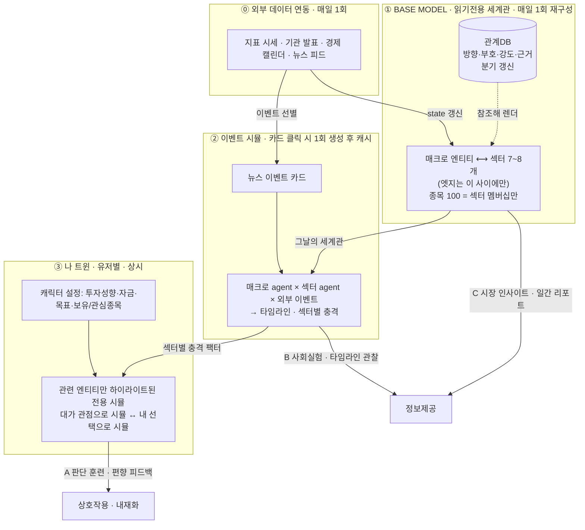

<!-- FINVERSE-DOC · AI 어시스트로 작성한 기획·설계 문서 (원본 소스코드와 구분) -->
> 🟦 **FINVERSE 기획·설계 문서** — AI 어시스트 작성 · 원본 소스(README · app/ · tools/ · worker/)와 **구분되는 산출물**입니다.
> 상태: 확정 · 최종 갱신 2026-07-31

# 구조 재정의 회의록 — A·B·C 연관관계 · 관계DB · 계층 단순화

- **일시**: 2026-07-31 (같은 날 「메인 시나리오 정렬」 회의에 이어지는 후속 세션)
- **참석자**: 이유정 (기획/프론트)
- **주제**: 3 대표 기능(A·B·C)의 연관관계 확정 · 그래프 관계 정의 방식 · 모듈 계층 단순화
- **관련 문서**: [07-29 회의록](./2026-07-29-기획-다듬기.md)(결정 #1~#9) · [07-31 메인 시나리오 정렬](./2026-07-31-메인-시나리오-정렬.md)(결정 #10~#13) · [PRD v0.5](../PRD.md)
- **결정 범위**: **#14 ~ #19** (+ 기존 #3·#9·#11·#12 개정)

---

## 1. 배경 — 제기된 세 가지 문제

오전 회의(결정 #10~#13) 이후 기획 검토에서 구조적 문제 3건이 제기됨. **이 3건이 해소되기 전에는 시나리오 세부 안건(변곡점 수·선택지 수 등)을 결정할 수 없다**고 판단해 안건 순서를 바꿈.

| # | 제기된 문제 | 검증 결과 |
| --- | --- | --- |
| 1 | A·B·C 3 대표 기능 분류 자체는 타당하나, **셋의 연관관계가 서비스 관점·기술 관점 모두에서 불명확**. 명확히 할 자신이 없으면 기능을 축소해야 함 | 타당 — 기존 PRD는 셋을 나란한 기능으로만 나열, 연결 지점 미명세 |
| 2 | 월드 그래프의 엣지가 **화살표 연결뿐이고 가중치·관계 성격이 없어 요식행위**에 가까움 | **사실 확인됨** — `demo/finverse-world.html:166`의 엣지 속성은 `{a, b, on, grow, hot}`으로 전부 시각 효과용. 관계의 방향·부호·강도를 담은 속성이 하나도 없음 |
| 3 | **M0~M8 계층이 과도하게 복잡**해 이해·분담·의사결정을 막음 | 타당 — 책임 분해로는 맞으나 실제 산출물 단위와 불일치 |

---

## 2. 결정 사항 (#14 ~ #19)

| # | 결정 | 근거 |
| --- | --- | --- |
| **14** | **4층 구조로 재정의.** ⓪외부 데이터 연동 → ①**Base Model**(읽기전용 세계관) → ②**이벤트 시뮬**(뉴스 카드 트리거) → ③**나 트윈**(유저 상호작용). **①·② = 정보제공(시장 이해·인사이트 리포트), ③ = 상호작용(내재화·예측).** | A·B·C는 나란한 기능이 아니라 **같은 Base Model을 점점 좁혀 쓰는 3단계**다. C는 세계 전체, B는 이벤트 하나로 흔든 세계, A는 내 것만 하이라이트한 세계. 연관관계가 계층으로 자명해지고, 진입 장벽도 정보제공→상호작용으로 자연 상승 |
| **15** | **섹터 계층 도입.** KOSPI 100 종목을 **7~8개 MECE 산업군**으로 분류. **그래프 엣지는 매크로 ↔ 섹터 간에만** 정의하고, 종목은 **섹터 멤버십만** 보유(매크로와 직접 연결하지 않음) | 연산량 급감(엣지 수백 → 수십). 유저 자산 영향은 `매크로 충격 → 섹터 → 종목 비중` 2-hop으로 계산 가능하므로 종목 단위 엣지가 불필요. 관계 정의를 **정성껏 할 수 있는 규모**로 낮추는 것이 핵심 |
| **16** | **관계는 그래프에 인라인하지 않고 별도 관계DB로 분리.** 각 관계는 **방향·부호·강도·근거**를 필수로 갖고, 그래프는 이 DB를 참조해 렌더링만 한다 | 문제 2의 직접 해법. 그래프는 표현 계층, 관계는 데이터 계층으로 분리해야 관계를 검증·개정·인용할 수 있음. 매크로↔섹터로 제한(결정 #15)했으므로 **총 60~70행 규모** — 한 행씩 근거를 달아 관리 가능 |
| **17** | **갱신 주기를 state와 관계로 분리한다.** **state(지표 수치·이벤트 발생)는 매일 1회** 외부 연동으로 갱신, **관계(방향·부호·강도)는 분기 정기 리뷰 또는 구조적 변화 시에만** 갱신 | 관계가 매일 흔들리면 Base Model이 "안정적 기반"이 아니게 됨. 매일 변해야 하는 것은 상태값이지 인과 구조가 아니다 |
| **18** | **결정 #9 개정 — 이벤트 카드 단위 온디맨드 생성 + 결과 캐시.** 뉴스에서 선별한 이벤트 카드를 클릭하면 **그날의 Base Model 위에서 시뮬을 1회 생성**하고 **즉시 캐시**한다. 이후 같은 카드는 모든 유저에게 리플레이로 서빙 | 시뮬 대상이 종목이 아니라 섹터라서 규모가 축소됨(**매크로 agent 10~15 + 섹터 agent 7~8, 라운드 5~8**). 캐시 키가 이벤트 카드이므로 **하루 생성 횟수 = 카드 수(5~10회)** — 유저 1,000명이 같은 카드를 눌러도 시뮬은 1회. #9의 취지(비용·안정성·재현성)를 지키면서 "현재 세계관 반영"이라는 새 요구를 만족 |
| **19** | **대가 4인은 ③ 나 트윈 전용 요소로 이동.** ② 이벤트 시뮬의 참여자는 **매크로 agent + 섹터 agent만**. 대가는 나 트윈에서 **"대표 투자자라면 어떻게 판단했을까"를 시뮬해 보는 참고·엔터테인먼트 장치**로 쓴다 | ②는 "시장이 어떻게 반응하나"(객관·관찰), ③은 "누구의 관점으로 볼 것인가"(주관·선택)로 역할이 분리됨. 대가를 A에 집중시키면 핵심 기능의 밀도가 올라가고, ②의 시뮬 규모도 함께 줄어듦. **실명 사용에 따른 면책 라벨 의무는 그대로 유지**(결정 #5) |

---

## 3. 확정 구조 — 4층



**A·B·C 재배치**

| | 기능 | 어느 층 | 성격 | 사용자가 얻는 것 |
| --- | --- | --- | --- | --- |
| **C** | 시장 인사이트 | ① Base Model 뷰 | 정보제공 | 오늘의 세계 구조와 일간 인사이트 리포트 |
| **B** | 사회실험 | ② 이벤트 시뮬 | 정보제공 | 이 사건에 매크로·섹터가 어떻게 반응하는지 관찰 |
| **A** | 판단 훈련 (핵심) | ③ 나 트윈 | **상호작용** | 내 상황에서 내 판단을 시험하고 편향을 발견 |

- **화면 흐름은 C → B → A** (기존 결정 #12의 C→A→B에서 순서 개정). **비중은 A > C > B 유지.**
- 연결 조인트 3개: ① C의 이벤트 카드 클릭이 B를 생성 · ② B의 섹터별 충격 팩터가 A의 계산 입력 · ③ A의 하이라이트 대상이 ①의 Base Model 부분집합.

---

## 4. 이전 결정의 개정 · 흡수

| 기존 | 처리 | 내용 |
| --- | --- | --- |
| **#3** 3계층 온톨로지(Force/Persona/Instrument) | **개정** | **매크로(지표·기관/정부·경제이벤트) / 섹터 / 종목** 3계층으로 재편. Persona(대가)는 온톨로지 계층이 아니라 **③ 전용 요소**로 분리(결정 #19) |
| **#9** MiroFish = 오프라인 전용, 라이브 시뮬 금지 | **개정** | 폐기 아님. **이벤트 카드 단위 온디맨드 생성 + 캐시**로 완화(결정 #18). "유저 요청마다 시뮬 재실행 금지"라는 원칙 자체는 캐시로 계속 지켜짐 |
| **#11** Progressive disclosure(내 종목 + 1-hop) | **흡수** | ③ 나 트윈의 "관련 엔티티만 하이라이트"가 이 역할을 그대로 수행. 별도 토글 설계 불필요 |
| **#12** 한 시나리오가 C→A→B 통과 | **개정** | 흐름 순서를 **C→B→A**로 변경(정보제공 2단계 → 상호작용). 비중 A>C>B는 유지 |
| **#4·#5** 대가 4인 실명 + 강한 면책 | **위치 변경 · 원칙 유지** | 로스터와 면책 라벨 의무는 그대로. 등장 위치만 ②→③으로 이동(결정 #19) |
| **#8** 무결성(유저가 쓸 공유 그래프 없음) | **유지** | Base Model·이벤트 시뮬 캐시 = 읽기전용(L1), 유저 기록은 트윈(L2)에만 |
| **#13** 스냅샷 = 요약 + 그래프 + 상호작용 트레이스 | **유지** | 스냅샷 단위가 "팀이 배치 생성한 시나리오"에서 "이벤트 카드"로 바뀔 뿐, 구성 요소는 동일 |

---

## 5. 관계DB 설계 (결정 #16)

**원칙 — 정직성**: 시뮬 트레이스·공개 자료에서 **도출 가능한 것만** 담는다. 근거 없는 정밀 수치(예: `0.73`)는 금지. 강도는 3단계 질적 값이 정직한 한계선이며, 이는 안전 원칙("가격·방향 단정 금지")과도 정합한다.

| 필드 | 값 | 설명 |
| --- | --- | --- |
| `from` / `to` | 엔티티 id | 관계의 방향 (출발 → 도착) |
| `kind` | `sets` \| `transmits` \| `drives` \| `triggers` \| `member_of` | 고정 어휘 5개 (§5.1) |
| `sign` | `+1` \| `-1` | 촉진 / 억제 |
| `strength` | `weak` \| `mid` \| `strong` | 3단계. **수치 금지** |
| `lag` | `immediate` \| `short` \| `mid` | 반영 시차 (선택) |
| `basis` | 문장 | 이 관계가 성립하는 이유 (유저에게 노출) |
| `evidence` | 출처 배열 | 공개 자료·데이터 분석·시뮬 트레이스 시점 |
| `confidence` | `low` \| `mid` \| `high` | 관계 자체에 대한 확신도 |
| `reviewedAt` | 날짜 | 마지막 검토일 (결정 #17: 분기 리뷰) |

**어휘 정의**

| kind | 방향 | 예 |
| --- | --- | --- |
| `sets` | 기관/정부 → 지표 | 미 연준 → 미 기준금리 |
| `transmits` | 지표 → 지표 | 미 기준금리 → 미국채 10년물 |
| `drives` | 지표 → 섹터 | 미국채 10년물 → 2차전지·화학소재 (`sign: -1`, `strength: strong`) |
| `triggers` | 경제이벤트 → 지표/섹터 | FOMC → 미 기준금리 |
| `member_of` | 종목 → 섹터 | 삼성전자 → 반도체·IT하드웨어 (그래프 엣지 아닌 멤버십 테이블) |

**규모 산정**: 지표 8 × 섹터 8 = 상한 64행(유의미한 것 ~40) + `sets` 8 + `transmits` 6 + `triggers` 6 ≒ **총 60~70행**. 종목 멤버십 100행은 별도 테이블.

**채택 기준 — "이 관계를 지우면 서비스에서 뭐가 깨지나?"** 관계가 실제로 소비되는 곳은 3곳뿐이다. 어디에도 쓰이지 않으면 등록하지 않는다.
1. **유저 자산 영향 계산**(③) — `drives`의 sign × strength가 섹터 충격 팩터가 되고, 종목 비중과 곱해진다
2. **근거 인용**(③ 편향 카드 · ① 인사이트 리포트) — `basis`·`evidence`를 그대로 문장으로 노출
3. **리플레이 연출**(②) — 타임라인 진행에 따라 해당 엣지가 활성화되는 시각 표현

**섹터 7~8개 초안 (MECE)**: 반도체·IT하드웨어 / 인터넷·소프트웨어 / 2차전지·화학소재 / 운송장비(자동차·조선·기계·방산) / 금융 / 헬스케어 / 소비재·유통·통신 / 에너지·산업재(철강·정유·건설·유틸). **1종목 1섹터 원칙**, 지주사만 예외 규칙 적용.

---

## 6. 이벤트 시뮬 생성·캐시 규칙 (결정 #18)

| 항목 | 규칙 |
| --- | --- |
| **트리거** | 실시간 뉴스 중 매크로(지표·기관·정부·경제이벤트) 관련성이 높은 건을 선별해 **이벤트 카드**로 노출 |
| **캐시 키** | `이벤트 카드 id + Base Model 날짜` — 같은 카드·같은 날이면 재생성하지 않음 |
| **생성 시점** | 카드 최초 클릭 시 1회. (운영 안정화 후 인기 예상 카드는 사전 생성 가능) |
| **시뮬 규모** | 매크로 agent 10~15 + 섹터 agent 7~8, 라운드 5~8 |
| **참여자** | 매크로 agent + 섹터 agent **만** (대가 4인은 참여하지 않음 — 결정 #19) |
| **산출물** | 타임라인 트레이스 · **섹터별 충격 팩터** · 3경로 전망 · 활성화된 관계 목록 |
| **무결성** | 생성 결과는 읽기전용(L1). 유저 입력은 트윈(L2)에만 기록 |
| **대기 UX** | 최초 클릭자에게는 생성 진행 표시. 【미확정】 목표 생성 시간과 타임아웃 정책 |

---

## 7. 모듈 단순화 (문제 3 해소)

M0~M8의 9개 라벨을 **실제 산출물 단위 4덩어리**로 접는다. (기존 M 번호는 PRD 내부 참조용으로만 유지)

```
[배치 파이프라인 · 매일]   외부연동 → state 갱신 → Base Model 빌드 → 뉴스 이벤트 카드 선별
        │  (관계DB 참조 — 분기 갱신)
[시뮬 생성기 · 카드 클릭 시 1회]   경량 agent 시뮬 → 이벤트 시뮬 스냅샷 저장
        │
[앱 서버 1개]   Base Model 조회 · 카드 목록 · 시뮬 스냅샷 조회 · 트윈 저장 · 선택→피드백
        │
[화면 3개]   V1 시장 인사이트(C) · V2 이벤트 시뮬(B) · V3 나 트윈(A)
```

→ "**매일 세계를 굽고, 카드마다 시뮬을 한 번 굽고, 서버 하나로 서빙하고, 화면 셋을 그린다.**" 개발 3인 분담 단위와도 일치.

---

## 8. 다음 액션

- [x] PRD v0.5 개정 — §4 4층 아키텍처 · §5 매크로/섹터/종목 + 관계DB · §6 데이터 계약 · §7 모듈 단순화
- [ ] 관계DB 60~70행 실제 큐레이션 (방향·부호·강도·근거) — 기획 + 곽동규
- [ ] 섹터 7~8개 확정 + KOSPI 100 종목 매핑 테이블 (지주사 예외 규칙 포함)
- [ ] 외부 데이터 연동 소스 확정 (지표 시세·경제 캘린더·뉴스 피드) — 개발
- [ ] 경량 agent 시뮬 프로토타입 1회 실행 → 생성 시간·토큰 실측 (결정 #18 타당성 검증) — 개발
- [ ] `demo/finverse-world.html`을 매크로↔섹터 구조로 재작성 (현재는 100종목 직결 구조)
- [ ] AGPL 의무 범위 확인 — 온디맨드 생성으로 바뀌며 재검토 필요

---

## 9. 8/1 회의 안건 (갱신)

**선결 3건은 본 회의에서 해소됨**(결정 #14~#19). 8/1은 아래를 확정한다.

| # | 안건 | 비고 |
| --- | --- | --- |
| 1 | 섹터 7~8개 최종 확정 + 종목 매핑 규칙 | §5 초안 검토 |
| 2 | 관계DB 큐레이션 담당·일정 (60~70행) | 근거 출처 기준 포함 |
| 3 | 이벤트 카드 선별 기준 (하루 몇 개, 무엇을 매크로 관련으로 볼 것인가) | |
| 4 | 나 트윈 캐릭터 설정 항목 확정 (투자성향·자금·목표·보유/관심종목) | 무보유 유저 템플릿 포트폴리오 포함 |
| 5 | 대가 4인 시뮬의 엔터 요소 수위 — 재미와 면책의 균형 | 실명 사용 권리 조항 확인 병행 |
| 6 | 편향 판정에 "왜 그렇게 판단했나" 한 줄 입력 포함 여부 | 기존 안건 유지 |
| 7 | 전망 표기를 단일 수치 대신 범위로 | 기존 안건 유지 |

※ 기존 안건이던 **변곡점 수·선택지 수·outcome 저장 방식**은 구조 변경으로 성격이 바뀜 — 변곡점은 이제 이벤트 시뮬 타임라인 위에서 정의되고, outcome은 **섹터 충격 팩터 × 트윈 보유 비중**으로 계산되므로 사전 저장 논쟁이 소멸(결정 #15·#16의 부수 효과).

## 10. 전체 결정 요약 (#1 ~ #19)

| # | 결정 (요약) | 상태 |
| --- | --- | --- |
| 1 | 핵심 기능 = 에이전트 시뮬(판단훈련 A + 사회실험 B), 가격예측 C는 모듈 | 유효 |
| 2 | C는 분리하되 이벤트/종목으로 코어에 연결 | 유효 |
| 3 | base = 3계층 온톨로지 | **#15로 개정** |
| 4 | 대가 4인 실명 로스터 | **#19로 위치 변경** |
| 5 | 실명 + 강한 면책 | 유효 |
| 6 | 캐릭터 → 아키타입 그룹핑 | 유효 |
| 7 | 나 트윈 = 출력 뷰(L2), 지속·누적 | 유효 |
| 8 | 무결성 = 유저가 쓸 공유 그래프 없음 | 유효 |
| 9 | 시뮬은 오프라인 배치 생성 | **#18로 개정** |
| 10 | 월드 그래프 = A의 근거 + B의 관찰 뷰 | 유효 |
| 11 | Progressive disclosure | **#14·③에 흡수** |
| 12 | C→A→B 통과, 비중 A>C>B | **순서 C→B→A로 개정** |
| 13 | 스냅샷 = 요약 + 그래프 + 상호작용 트레이스 | 유효 |
| **14** | **4층 구조 · ①② 정보제공 / ③ 상호작용** | 신규 |
| **15** | **섹터 계층 도입 · 엣지는 매크로↔섹터만** | 신규 |
| **16** | **관계DB 분리(방향·부호·강도·근거)** | 신규 |
| **17** | **갱신 주기 분리 — state 매일 / 관계 분기** | 신규 |
| **18** | **이벤트 카드 단위 온디맨드 생성 + 캐시** | 신규 |
| **19** | **대가 4인 = ③ 나 트윈의 참고·엔터 요소** | 신규 |
